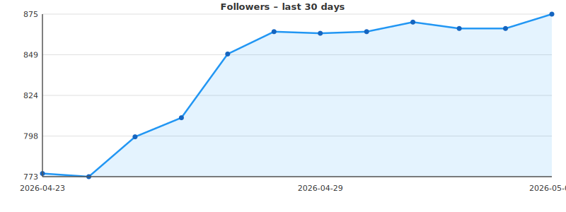

# gh-stats

Automatically tracks the daily GitHub follower count for [@sahils0](https://github.com/sahils0) and renders a 30-day trend graph below.

## Follower count – last 30 days



## How it works

| Component | Description |
|---|---|
| `.github/workflows/update-followers.yml` | Runs every day at 00:00 UTC (and can be triggered manually via `workflow_dispatch`). Requires `contents: write` permission so it can commit the updated data back to the repository. |
| `scripts/update_followers.py` | Calls the GitHub REST API (`/users/sahils0`) to get the current follower count, appends a row to `data/followers.csv`, and regenerates `assets/followers-30d.svg` using pure Python (no extra dependencies). |
| `data/followers.csv` | Persistent store — one row per day (`date`, `followers`). A run on an existing date overwrites that day's entry instead of duplicating it. |
| `assets/followers-30d.svg` | Auto-generated chart embedded in this README. Reflects the most recent 30 entries. |

### Run manually

```bash
# Make sure GITHUB_TOKEN is set (or omit for unauthenticated / lower rate-limit)
export GITHUB_TOKEN=your_personal_access_token
python scripts/update_followers.py
```

You can also trigger the workflow from the **Actions** tab → **Update Follower Count** → **Run workflow**.